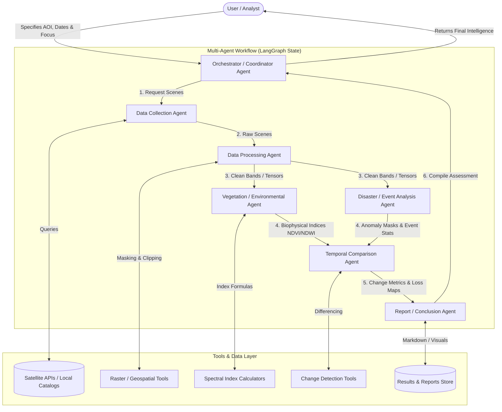

# System Architecture: Multi-Agent Environmental Analysis System

> **Document Status**: Architectural Blueprint (Phase 0 — Proposed Design)  
> **Notice**: This document outlines the proposed design and component boundaries. Components are in development and are **not yet implemented**.

---

## 1. Architectural Philosophy

The Multi-Agent Environmental Analysis System is built on the principle of **modular agent specialization coordinated by a deterministic state machine**. 

Environmental analysis of satellite data involves diverse steps—from API querying, raster I/O, and mathematical radiometric calculations to temporal diffing and domain-specific narrative reporting. A single monolithic LLM prompt or an unconstrained autonomous loop is prone to hallucinations, unbounded token usage, and brittle execution. 

By contrast, this architecture decouples the system into:
1. **Specialized Agents**: Each with a tight, well-defined mandate and access only to necessary tools.
2. **Deterministic Orchestration**: State transitions and data flow are governed via a structured graph (such as LangGraph).
3. **Reproducible Python Tools**: Heavy numerical calculations (NDVI, raster differencing) are handled by deterministic Python code, reserving the LLM for planning, validation, anomaly interpretation, and synthesis.

---

## 2. High-Level Architecture Flow

The end-to-end flow follows a clear, directional progression:

$$\text{User Query} \longrightarrow \text{Orchestrator} \longrightarrow \text{Specialized Agents} \longrightarrow \text{Tools / Data} \longrightarrow \text{Analysis} \longrightarrow \text{Final Report}$$



---

## 3. Proposed Agents and Responsibilities

### 1. Orchestrator / Coordinator Agent
- **Role**: Workflow manager and system interface.
- **Responsibilities**:
  - Ingests user input (geographic bounds, target dates, analysis intent).
  - Validates parameters against system constraints.
  - Initializes the shared workflow state.
  - Dynamically routes tasks to specialized downstream agents based on intermediate results.
  - Performs quality-gate checks before delivering the final output to the user.
- **Status**: Conceptual / Planned for Phase 4.

### 2. Data Collection Agent
- **Role**: Data acquisition specialist.
- **Responsibilities**:
  - Translates user coordinates/AOI into remote sensing catalog queries (e.g., STAC API, Copernicus Data Space, or local offline data archives).
  - Filters scenes based on temporal window and cloud cover constraints.
  - Fetches the required spectral bands (e.g., Red, Near-Infrared [NIR], Short-Wave Infrared [SWIR]).
  - Logs metadata (acquisition timestamp, sun elevation, sensor platform).
- **Status**: Conceptual / Planned for Phase 1.

### 3. Data Processing Agent
- **Role**: Geospatial data preprocessor.
- **Responsibilities**:
  - Crops full satellite scenes down to the specified bounding box.
  - Applies cloud and shadow masks (e.g., QA60 band or SCL scene classification).
  - Reprojects rasters to a common Coordinate Reference System (CRS).
  - Normalizes digital numbers (DN) to Top-Of-Atmosphere (TOA) or Surface Reflectance (SR) floats.
- **Status**: Conceptual / Planned for Phase 2.

### 4. Vegetation / Environmental Analysis Agent
- **Role**: Biophysical index and vegetation vitality evaluator.
- **Responsibilities**:
  - Computes standard spectral indices:
    - **NDVI** (Normalized Difference Vegetation Index): $\frac{\text{NIR} - \text{Red}}{\text{NIR} + \text{Red}}$
    - **NDWI** (Normalized Difference Water Index): $\frac{\text{Green} - \text{NIR}}{\text{Green} + \text{NIR}}$
    - **EVI** (Enhanced Vegetation Index): for high-biomass canopy penetration.
  - Generates distribution histograms and zonal statistics (mean, median, standard deviation).
  - Classifies canopy health into discrete categories (dense, moderate, sparse, barren).
- **Status**: Conceptual / Planned for Phase 3.

### 5. Temporal Comparison Agent
- **Role**: Multi-temporal change detector.
- **Responsibilities**:
  - Aligns index rasters across two or more time horizons ($T_1$ baseline vs. $T_2$ current).
  - Computes pixel-wise difference maps: $\Delta \text{NDVI} = \text{NDVI}_{T_2} - \text{NDVI}_{T_1}$.
  - Applies statistical thresholding to isolate genuine environmental changes from seasonal variations.
  - Identifies clusters of significant degradation, deforestation, or agricultural loss.
- **Status**: Conceptual / Planned for Phase 3 & Phase 5.

### 6. Disaster / Event Analysis Agent
- **Role**: Extreme event and shock analyst.
- **Responsibilities**:
  - Evaluates acute environmental disturbances when relevant (wildfires, flood inundation, prolonged drought).
  - Computes specialized disturbance indices (e.g., Normalized Burn Ratio - NBR for fire scars).
  - Flags rapid-onset anomalies compared to historical baselines.
  - Quantifies total affected area in hectares or square kilometers.
- **Status**: Conceptual / Planned for Phase 3 & Phase 5.

### 7. Report / Conclusion Agent
- **Role**: Technical synthesis and narrative intelligence generator.
- **Responsibilities**:
  - Aggregates tabular metrics, statistical summaries, and file links from all preceding agents.
  - Synthesizes findings into natural-language environmental intelligence.
  - Formats output into a clean, executive-ready Markdown or PDF report.
  - Formulates actionable conclusions and recommendations for end-users.
- **Status**: Conceptual / Planned for Phase 6.

---

## 4. Shared State Architecture

Agents communicate through a **strictly typed shared state** (implemented via Pydantic and LangGraph):

```
State {
    aoi_bounds: BoundingBox
    dates: List[Date]
    user_intent: AnalysisType
    raw_scenes: List[SceneMetadata]
    processed_rasters: Dict[Date, RasterPaths]
    indices: Dict[Date, IndexStatistics]
    temporal_changes: ChangeDetectionSummary
    event_analysis: Optional[DisasterImpactSummary]
    final_report_markdown: str
    errors: List[str]
}
```

This ensures that:
- Every agent operates on immutable inputs and appends traceable updates to the graph state.
- Intermediate results (rasters, figures, statistics) are saved locally on disk, with file pointers passed in memory rather than large raw binaries.
- If an agent encounters a failure (e.g., cloud cover exceeds limit), the graph can trigger a compensatory or fallback branch.

---

## 5. Scope & Engineering Realism

For the purposes of this engineering mini-project:
- We prioritize **robustness, modularity, and a working end-to-end prototype** over complex multi-modal sensor fusion.
- Where live API rate limits or network issues pose constraints, the system will support pre-downloaded or curated sample satellite tiles (`data/sample/`) to ensure deterministic testing and demonstrations.
